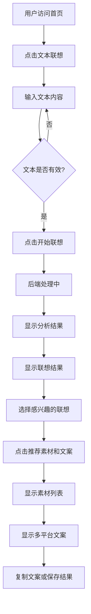
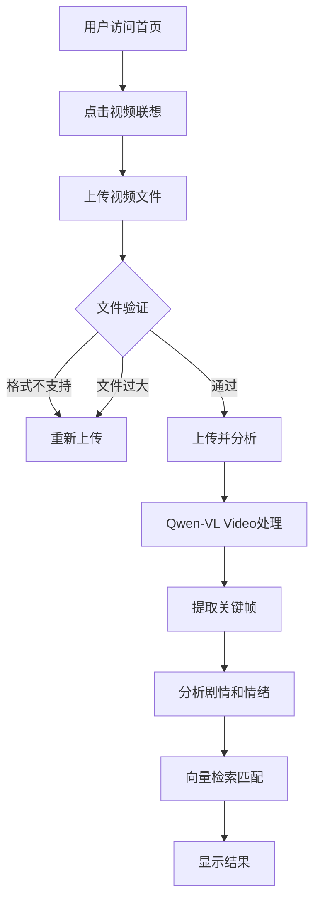
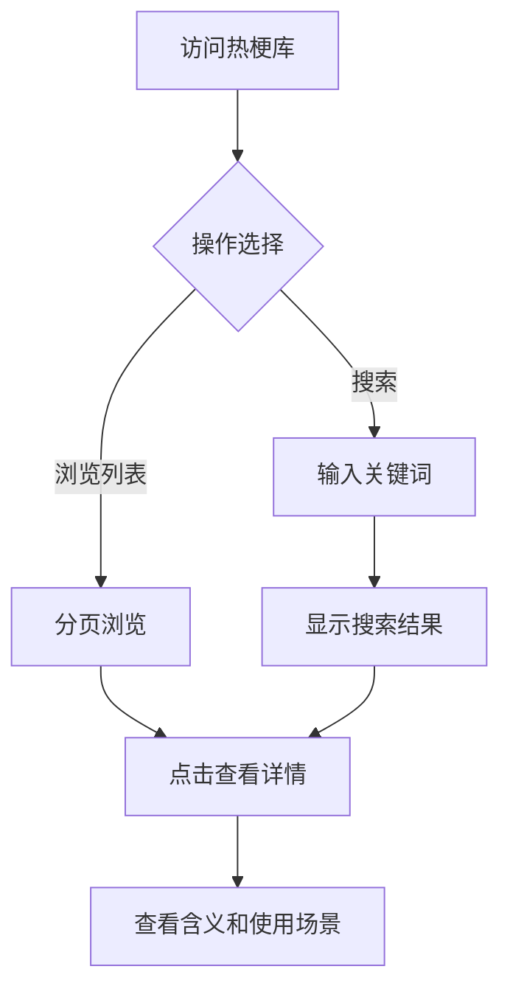
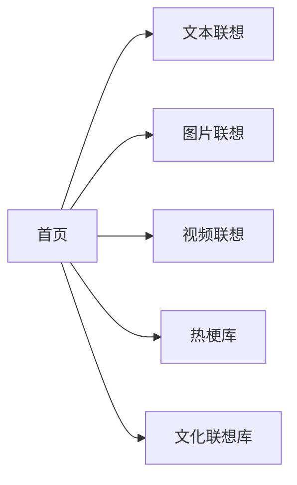

# 用户流程图

## 1. 核心用户流程

### 1.1 文本联想流程



### 详细步骤说明

1. **访问首页
   - 用户看到三个主要功能入口
   - 快速了解产品介绍和使用引导

2. **进入文本联想页面
   - 大文本输入区域
   - 字数统计和提示

3. **输入内容
   - 支持1000字以内文本
   - 实时字数显示

4. **提交分析
   - 发送请求到后端
   - 显示加载状态

5. **查看结果
   - 情绪、关系、场景分析
   - 联想卡片展示
   - 匹配度评分

6. **选择素材
   - 点击卡片选择
   - 支持多选

7. **获取推荐
   - 素材推荐列表
   - 多平台文案生成

8. **使用结果
   - 一键复制文案
   - 下载素材

---

### 1.2 图片联想流程

```mermaid
flowchart TD
    A[用户访问首页] --> B[点击图片联想]
    B --> C[上传图片文件]
    C --> D{文件验证]
    D -->|格式错误| E[提示重新上传]
    D -->|大小超限| E
    D -->|通过| F[开始分析]
    F --> G[Qwen-VL识别]
    G --> H[内容理解]
    H --> I[向量检索]
    I --> J[显示联想结果]
    J --> K[选择联想]
    K --> L[推荐素材和文案]
```

---

### 1.3 视频联想流程



---

### 1.4 热梗库浏览流程



---

## 2. 用户故事

### 故事1：自媒体创作者使用文本联想

**角色：** 抖音创作者
**场景：**
1. 创作者想写一篇关于加班的文案
2. 输入"老板周末让我加班
3. 获得多种联想
4. 选择猫和老鼠、灭霸响指
5. 获取抖音风格文案
6. 配上推荐GIF素材
7. 直接使用

---

### 故事2：B站UP主使用视频联想

**角色：** B站UP主
**场景：**
1. 上传一段搞笑视频
2. AI分析视频内容
3. 联想相关名场面
4. 获取推荐素材片段
5. 生成B站风格文案
6. 用于二次创作

---

## 3. 页面导航流程


